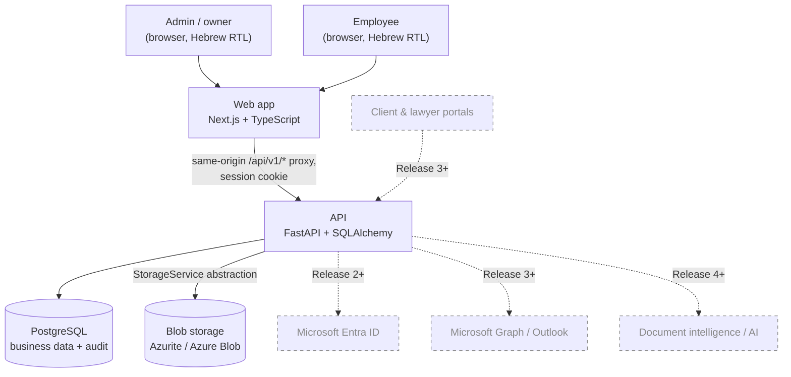
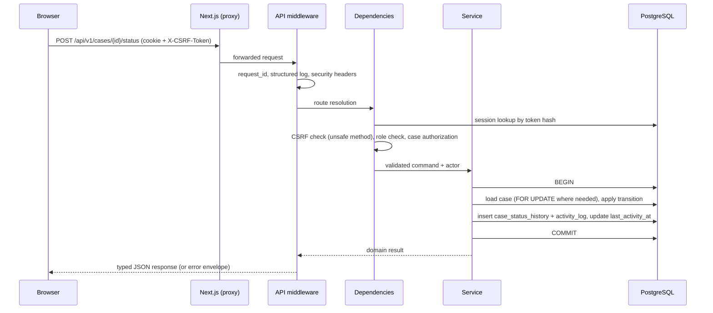
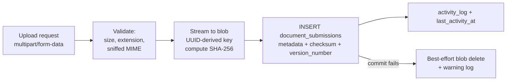

# Architecture

> **Status:** Phases 0–3 implemented; the rest is the agreed target design.
>
> **In the repository today:** the runtime topology and migration workflow of §3; **every package of
> §4** — `main`, `api`, `schemas`, `services`, `repositories`, `auth`, `audit`, `models`, `db`,
> `domain`, `core`, `cli` — and the import contracts that hold them apart; the middleware chain, error
> envelope and transaction boundary of §5; the **authentication provider boundary, session management
> and role gates of §6**; the audit recorder and its append-only table in §7, now carrying real
> authentication events; the **Hebrew RTL web shell, login UI, typed API client and generated
> OpenAPI types of §9**; the configuration, logging and health endpoints of §10; the test-database
> harness of §11; and the quality gates of §12 including migration-drift detection and the
> OpenAPI-types freshness check.
>
> **Still design:** the object- and query-scoping halves of §6 (they need `people` and `cases` to scope
> *to*), §8 (document storage), and the feature-facing parts of §7 (case workflow,
> `last_activity_at`). This document is updated at the end of every implementation phase to match the
> code.
> Last reviewed: 2026-09-06

## 1. Purpose and constraints

The platform is the internal system of record for actuarial/financial consultancy cases. Release 1
builds the operational foundation; later releases add portals, payments, Microsoft 365 integration,
document intelligence and AI features. The architecture is therefore optimised for:

1. **Correctness** — invariants enforced in the database and in one service layer, not in controllers.
2. **Security** — every access decision is made server-side, defence in depth on uploads and sessions.
3. **Auditability** — an append-only business audit trail written in the same transaction as the change.
4. **Maintainability** — explicit layers with a single direction of dependency.
5. **Extensibility** — abstractions at exactly the boundaries we know will change (identity, storage,
   workflow transitions), and nowhere else.

Non-goals for Release 1: multi-tenancy, horizontal scale beyond a handful of concurrent internal
users, offline support, public endpoints of any kind.

## 2. System context



Only the solid arrows are in Release 1 scope. The dashed elements exist in this diagram to document
where they attach: identity through the authentication provider abstraction (§6), documents through
the storage abstraction (§8), and everything else through new API modules that reuse the same service
and audit layers.

## 3. Runtime topology

### Local development (Docker Compose)

Implemented.

| Service | Image / build | Port | Notes |
| --- | --- | --- | --- |
| `db` | `postgres:18.6-trixie` | 5432 | Named volume on `/var/lib/postgresql`, `pg_isready` healthcheck. Holds `pg_trgm` and the four infrastructure tables |
| `azurite` | `mcr.microsoft.com/azure-storage/azurite:3.37.0` | 10000 | Blob endpoint only (`azurite-blob`), named volume, TCP healthcheck; well-known emulator credentials |
| `api` | `infra/docker/api.Dockerfile` | 8000 | `alembic upgrade head`, then `uvicorn --reload` over a bind-mounted source tree; `/healthz` healthcheck |
| `web` | `infra/docker/web.Dockerfile` | 3000 | `next dev`; rewrites `/api/v1/*` to `api` so cookies stay first-party |

The `api` service receives its own `DATABASE_URL` (the `db` service on port 5432) from Compose. The
`DATABASE_URL` in `.env` is the *host's* view of the same database and belongs to everything that runs
outside the network — `./scripts/migrate`, `./scripts/test`, Alembic and pytest. Two views, each
written down once.

The browser only ever talks to the web origin. This is what makes `SameSite=Lax` session cookies work
without `SameSite=None`, and it is the same shape we deploy in production (ADR-0005). Port 8000 is
published for developer diagnostics; no browser code addresses it.

Both Dockerfiles are development images. The production multi-stage builds belong to Phase 10.

### Schema migrations

Alembic owns the schema. Nothing in the application or the test suite calls
`Base.metadata.create_all()`, so there is exactly one description of the database and it is the one
under review in a pull request. `migrations/env.py` runs against the same async engine the
application uses, reads its URL from the application's settings (overridable with
`-x db_url=...` or, for the test harness, `config.attributes["db_url"]`), and installs the
application's logging pipeline so a migration's output is structured like everything else.

**Development** applies migrations at container start-up (ADR-0033): a single-container stack has no
deployment pipeline to run them from, and a developer switching branches should get a matching schema
without remembering a second command.

**Production must not do this.** Several replicas starting at once would race each other through the
same DDL, and a failed migration would take the deployment down one container at a time instead of
failing before any traffic moved. The deployment runs `alembic upgrade head` once, as its own step,
before the new revision starts — under a database role that holds `CREATE`/`DROP` while the runtime
role does not (Phase 10; [`security.md`](security.md) §9). Migrations therefore have to be
backward-compatible with the revision still serving traffic during a rollout, which is a constraint on
how they are written, not a runtime setting: additive first, destructive changes in a later release.

**Drift** between the models and the head revision is a test, not a habit:
`tests/integration/test_migrations.py` runs Alembic's autogenerate comparison and fails on any diff.
Its limits are worth stating — autogenerate does not see triggers, functions, extensions or grants, so
the append-only trigger is covered by behavioural tests (`test_activity_log_immutability.py`) and the
`pg_trgm` extension by a schema assertion instead.

### Production target (Release 1+, not deployed in Release 1)

Two container images (`web`, `api`) on Azure Container Apps behind a single hostname with path-based
routing (`/api/*` → api, everything else → web); Azure Database for PostgreSQL Flexible Server with
TLS enforced; Azure Blob Storage with private containers only; Azure Key Vault as the source of
secrets, surfaced to the containers as environment variables; Application Insights / Azure Monitor
for logs, traces and availability. No code in the application reads Key Vault or Azure Monitor
directly — configuration always arrives as environment variables (ADR-0020) and telemetry is emitted
through OpenTelemetry-compatible logging (§10).

## 4. Backend layering

```text
apps/api/
  app/
    main.py          FastAPI application, middleware, exception handlers, routers   [exists]
    api/             HTTP layer: routers, dependencies, request/response wiring only [exists]
    schemas/         Pydantic v2 request/response models (the public contract)      [exists]
    services/        Use cases: transaction boundary, orchestration, audit + activity emission [exists]
    repositories/    Query/persistence encapsulation, including actor-scoped queries [exists]
    models/          SQLAlchemy ORM mappings                                        [exists]
    domain/          Pure logic: enums, status-transition graph, invariants, value objects [exists]
    db/              Engine, session factory, unit of work, base metadata           [exists]
    auth/            Password hashing, session handling, identity providers, policies [exists]
    storage/         StorageService protocol + Azure Blob adapter + test fake   [Phase 6]
    audit/           Audit recorder and action catalogue                            [exists]
    core/            Settings, logging, errors, pagination, time, request context   [exists]
    cli/             Operator commands that run outside the API (admin bootstrap)   [exists]
  migrations/        Alembic environment and revisions                              [exists]
  tests/             unit/ (no database), integration/ (real PostgreSQL), support/  [exists]
```

Tests sit beside `app/`, not inside it, so they are never packaged into the runtime image. Migrations
sit beside `app/` too, for two reasons: they import the models to build `target_metadata`, which
`app.db` is not permitted to do, and they are a historical record rather than application code —
revision `0001` must keep running unchanged years after the model it created has moved on.

Packages without `[exists]` are created by the phase that first needs them; an empty directory would
be an architecture diagram pretending to be code. The layering contract already names them, so they
are governed from the moment they appear. Only `storage/` is still absent, and it arrives with
document uploads in Phase 6.

Dependency rules, verified in CI by `import-linter`:

| Layer | May import | Must never import |
| --- | --- | --- |
| `api` | `schemas`, `services`, `auth`, `core`, `domain` | `repositories`, `models` directly |
| `services` | `repositories`, `models`, `domain`, `audit`, `storage`, `core` | `fastapi`, `api`, `schemas` |
| `repositories` | `models`, `domain`, `core`, `db` | `services`, `api`, `schemas` |
| `domain` | `core` (types only) | `sqlalchemy`, `fastapi`, `repositories`, `services` |
| `storage`, `audit` | `core`, `models` (audit only), `domain` | `api`, `services` |

Five contracts express that table in `pyproject.toml`. Four of them are worth explaining, because the
obvious single contract would not have held:

1. **A layers contract** orders `main → api → schemas → services → auth → audit/storage →
   repositories → models → db → domain → core`, with the not-yet-created layers marked optional.
2. **`api` may not import `models`.** A layers contract only forbids the *upward* direction; reaching
   past the service layer straight into the ORM is downward, and has to be forbidden by name. This one
   checks *direct* imports only (`allow_indirect_imports`), because the rule being protected is "no
   router may name an ORM class" — and any router that calls a service at all inevitably reaches
   `app.models` transitively, since services are what talk to the ORM. Left strict, the contract would
   have failed the moment the service layer existed, which would have meant deleting a real rule to
   satisfy a tautology.
3. **`domain` is pure** — no `sqlalchemy`, `fastapi`, `starlette` or `alembic`, so the transition
   graph and the Israeli ID checksum stay unit-testable without a database.
4. **Only the HTTP layer imports the web framework.** `audit`, `core`, `db`, `domain`, `models` and
   `schemas` may not import `fastapi` or `starlette`, so everything below the routers is callable from
   a script, a scheduled job or a test with no request in sight.

Practical consequences:

- Routers contain no business rules and no queries. They validate input, resolve dependencies
  (current user, authorized case), call one service method, and return a typed response model.
- Services own the transaction and are the only place that may change state. Any state change that is
  "meaningful" (§7) emits an audit event and touches `last_activity_at` in the same transaction.
- `domain` is importable from tests without a database, which is where the status-transition graph,
  the Israeli ID checksum, and case-number formatting are unit-tested.
- Raw ORM objects never leave the service layer; responses are always Pydantic models.

`repositories` exists for a concrete reason, not ceremony: employee visibility is enforced by
*scoping queries*, not by post-filtering. `CaseRepository.list_for_actor(actor, filters)` adds the
`EXISTS (SELECT 1 FROM case_assignments …)` predicate for `EMPLOYEE` actors, so a forgotten check in a
list endpoint cannot leak rows (ADR-0013). Trivial entities are allowed to have thin repositories;
we do not create a repository per table for its own sake.

## 5. Request lifecycle



Middleware order (outermost first, as installed today): request context/ID → structured access log →
security headers → CORS (development only, strict allowlist) → router. The body-size guard joins the
chain in Phase 6 with uploads. Exception handlers translate application errors into the error envelope
defined in [`api.md`](api.md); unhandled exceptions are logged with the `request_id` and returned as a
generic 500 with no stack trace or internal detail.

**Request ID.** Every request is given a fresh UUID4 by the outermost middleware, which binds it to a
`ContextVar` and to structlog's context, returns it as `X-Request-ID`, and puts it in the error
envelope. The audit recorder stamps it on every row it writes, so a business event in `activity_log`
can be joined to the application logs of the request that produced it. A client-supplied
`X-Request-ID` is **ignored** (ADR-0032): accepting one lets a caller collide, forge or inject into log fields,
and the correlation is worth nothing if it is attacker-controlled. Propagating a trusted upstream
trace id is a distinct feature and would arrive as a separate, validated header.

### Transaction boundary

One `AsyncSession` per request, created by a FastAPI dependency (`app/db/session.py`) and closed when
the response is finished. The **service method** is the transaction boundary: `app/db/uow.py` exposes
an `async with transaction(session):` block that commits on success and rolls back on any exception.
Repositories never commit. Routers never commit. The audit recorder flushes but never commits, so it
joins whatever transaction its caller opened.

This is what guarantees the property the specification requires — that audit history cannot diverge
from the data it describes — because a rollback discards both.
`tests/integration/test_transaction_boundary.py` proves it rather than asserting it in prose: a
minimal service creates a user and its audit row, and when the second attempt violates the unique
constraint on `users.email`, neither the user nor the audit row survives. Read-only requests run in a
transaction that is rolled back at the end.

Optimistic concurrency: `Case` and `DocumentRequirement` carry a `version` column mapped as
SQLAlchemy's `version_id_col`. Clients send the version they read; a mismatch returns `409` rather
than silently overwriting a colleague's edit (ADR-0019).

## 6. Authentication and authorization architecture

Authentication is split into three replaceable pieces so that adding Entra ID later is additive. All
three are implemented:

1. **Identity storage** — `user_identities` rows link a `User` to `(provider, provider_subject)`.
   Release 1 creates `PASSWORD` identities holding an Argon2id hash. An Entra ID login later inserts a
   `MICROSOFT_ENTRA` identity for the same user with no schema change to `users`.
2. **`AuthenticationProvider` protocol** (`auth/provider.py`) — one method,
   `authenticate(credentials) -> AuthenticationResult`, generic over the credential type. Release 1
   ships `PasswordAuthenticationProvider`. An `EntraIdAuthenticationProvider` implements the same
   protocol with an OIDC code flow, and its `Credentials` type is an authorization code rather than an
   email and password. There is deliberately no registry, no discovery and no plugin loader: two
   providers do not need one.

   It returns a result rather than raising, and that is load-bearing. An authentication *failure* is a
   state change — it increments `failed_attempt_count` and can set `locked_until`. A provider that
   raised would unwind the service's `transaction()` block and take the lockout counter with it,
   leaving unlimited password guesses. So the provider reports an outcome, the service commits the
   counters and the audit row, and the uniform `401` is raised *after* the commit. The provider says
   what happened in enough detail for the audit trail; assembling the single public failure is the
   service's job.
3. **Session issuance** (`auth/sessions.py`) — provider-independent, consuming an
   `AuthenticatedIdentity` that carries no secret and no provider-specific detail. A successful
   authentication of any kind produces a server-side session (see [`security.md`](security.md) §3), so
   the session, CSRF, logout and revocation logic is written once and inherited by every provider that
   follows.

Two supporting modules exist for the same reason: `auth/hashing.py` owns Argon2id and the dummy-hash
timing defence, and `auth/tokens.py` owns every random value in the authentication path — session
tokens, CSRF tokens and temporary passwords — so "which of these is hashed, and how" is one file's
answer rather than three call sites'.

Authorization is a dedicated policy module (`auth/policies.py`) of pure functions over an
`AuthenticatedActor`, invoked from routers via dependencies and from services for defence in depth.
Three mechanisms, used deliberately:

- **Role gates** — `ensure_role(actor, UserRole.ADMIN)` for admin-only endpoints (user management,
  case creation, assignment management, archiving, global audit). **Implemented**, along with
  `ensure_password_rotated`, the gate that keeps an account holding a temporary password confined to
  the three endpoints it needs in order to escape that state.
- **Object policies** — `ensure_can_view_case`, `ensure_can_edit_case`, `ensure_can_archive_case`,
  `ensure_can_review_document`, `ensure_can_view_person_detail`, `ensure_can_edit_person`. Pure
  functions over `(actor, access_facts)`, where the facts are resolved once per request. **Not
  written yet, on purpose:** an `ensure_can_view_case` authored before `cases` exists would be a
  guess. They arrive with the phases that introduce those objects.
- **Query scoping** — actor-scoped repository methods for every list/aggregate query (ADR-0013).
  Arrives with the entities that need scoping.

The actor itself is a frozen five-field dataclass — id, email, name, role, `must_change_password` —
resolved from the session cookie by the `CurrentActor` dependency. Raw session ORM rows never leave
`app.auth`, so no endpoint can accidentally serialise one, and no policy can come to depend on a
field that is not part of the authenticated identity.

Person access is resolved by a single predicate,
`PersonAccessService.has_full_access(actor, person_id)` — true for any `ADMIN`, and for an `EMPLOYEE`
only when that person has an active participation in a case currently assigned to them. Both
`ensure_can_view_person_detail` and `ensure_can_edit_person` consume it, and the response schema
(`PersonDetail` vs `PersonSummary`) is chosen from the same result, so the read scope, the write scope
and the serialised field set cannot drift apart (ADR-0027).

Hiding a button in the UI is never an authorization mechanism; the web app hides controls purely for
usability and every corresponding endpoint enforces the same rule independently, with tests asserting
it (see [`roadmap.md`](roadmap.md) exit criteria).

## 7. Case workflow, activity and audit

**Status transitions** go through a single `CaseWorkflowService.change_status(...)`, and nothing else in
the codebase may assign `Case.status`. Every transition — whatever the case type — is authorized, writes
an append-only `case_status_history` row, emits an audit event and updates `last_activity_at`, all in one
transaction. Because the service is the only entry point, later automation (a scheduler, an inbound email
handler, an AI agent) inherits all of that by calling the same method.

*Validation*, unlike the rest, depends on the case's type, because only `RESOURCE_BALANCING` has a
defined business process today (ADR-0009). `domain/case_workflow.py` declares a `WorkflowPolicy`
protocol and a registry keyed by `case_type`:

| Case type | Policy | Behaviour |
| --- | --- | --- |
| `RESOURCE_BALANCING` | `GraphWorkflowPolicy` | Enforces the documented graph; out-of-graph transitions are rejected except for an `ADMIN` supplying a mandatory `reason`, recorded on the history row and in the audit event as an override |
| all others | `OpenWorkflowPolicy` (default) | Any status may follow any status; the business has no defined sequence for these engagements yet |

No-op transitions are rejected under either policy. Giving another case type a real workflow later means
writing a graph and registering it against the type — the service, the API and the UI do not change,
which is what "additive" has to mean in practice. Q3 in [`open-questions.md`](open-questions.md) remains
open only on whether the documented graph matches the real resource-balancing process.

**Audit** (`audit/recorder.py`) is implemented. It is bound to the caller's session and used by
services: `recorder.record(action=..., entity_type=..., entity_id=..., case_id=..., description=...,
metadata=..., changes=...)`, where `action` and `entity_type` are members of the typed catalogue in
`audit/actions.py`. The recorder fills in `occurred_at` and the current `request_id`, adds the row and
flushes it, and never commits — so it lands in `activity_log` inside the service's transaction or not
at all. `UPDATE`/`DELETE`/`TRUNCATE` on that table is blocked by a database trigger, so "immutable
through normal application operations" is enforced by PostgreSQL, not by convention (ADR-0010).
Application logs are for operators; they are never the business history.

**`last_activity_at`** is updated only by an explicit allowlist of meaningful actions, resolved from
the audit action in one place (`domain/activity.py`). Reads never touch it — including document
downloads, which are audited for accountability but are not activity. The staleness threshold is the
configuration value `CASE_INACTIVITY_THRESHOLD_DAYS` (default `14`), read from settings wherever
"stuck" is computed; the number 14 appears exactly once in the codebase, in the settings default.

## 8. Document storage architecture



- `StorageService` is a `Protocol` with `put_stream`, `open_stream`, `delete`, `exists`. Adapters:
  `AzureBlobStorageService` (Azurite in dev, Azure Blob in production, same code path) and
  `InMemoryStorageService` for tests. Services depend on the protocol only; no Azure SDK type appears
  outside `storage/` (ADR-0012).
- Storage keys are derived exclusively from server-generated UUIDs — the layout is
  `cases/<case_id>/requirements/<requirement_id>/<submission_id>` — so the key is stable, collision-free
  and traceable back to its case. User-supplied filenames are stored as metadata and used only,
  sanitised, in the `Content-Disposition` header on download. There is no code path where a
  client-supplied string reaches a blob path.
- Files are never overwritten. A new upload for the same requirement creates a new
  `document_submissions` row with the next `version_number` and its own key.
- Downloads stream through the API after authorization, so no blob URL or SAS token is ever handed to
  a browser in Release 1. Direct-to-blob upload/download with short-lived user-delegation SAS is a
  deliberate later optimisation for large files.
- Ordering is blob-first, then the database row, with best-effort cleanup on commit failure. The
  alternative (row first) can produce a database row pointing at a missing file, which is worse: it
  breaks a user-visible promise instead of leaving an unreferenced blob. Unreferenced blobs are
  detectable by a reconciliation script (Phase 9) and cost nothing but storage.

## 9. Frontend architecture

```text
apps/web/src/
  app/                      App Router: (auth)/login, (app)/ home and change-password
  components/ui/            shadcn/ui primitives (RTL-verified)
  components/               Shared presentational components, including the application shell
  features/auth/            Login and password-change forms, zod schemas, TanStack Query hooks
  lib/api/                  Typed fetch client + generated OpenAPI types + error mapping
  lib/                      Formatting (dates, numbers), utils, constants
  messages/he.ts            Single Hebrew message catalog, accessed through t()
  proxy.ts                  Cookie-presence redirect to /login (UX only)
```

Phase 3 filled this in. `(auth)/login` is the public screen; `(app)/` is the authenticated shell.
People, cases, documents and the dashboard routes arrive with those phases — the home page says so
rather than inventing placeholder screens.

- **Typed contract, no drift.** `lib/api/schema.d.ts` is generated from the API's OpenAPI document by
  `openapi-typescript` and checked in; CI regenerates it and fails if it differs. Request/response
  types are derived from it, so a backend contract change breaks the frontend build rather than
  production (ADR-0017).
- **No business logic in components.** Server calls live in feature `queries.ts` modules on top of
  TanStack Query; forms use `react-hook-form` + `zod`; derived display logic lives in feature hooks or
  `lib/`. Components render props and dispatch callbacks.
- **RTL first.** `<html lang="he" dir="rtl">`, Tailwind logical properties (`ms-*`, `me-*`, `ps-*`,
  `pe-*`, `text-start`, `text-end`) rather than physical `left/right`, and a Hebrew-capable font loaded
  via `next/font`. shadcn/Radix primitives receive `dir="rtl"` through a provider.
- **Hebrew copy in one place.** All strings — labels, statuses, case types, participant roles, error
  messages, empty states — come from `messages/he.ts` via a `t()` helper. No hardcoded Hebrew in JSX.
  API error `code` values are mapped to Hebrew messages by a single mapper. Swapping in `next-intl`
  later touches the helper and the catalog, not the features (ADR-0018).
- **Dates.** All instants arrive as UTC ISO-8601 and are rendered with
  `Intl.DateTimeFormat('he-IL', { timeZone: 'Asia/Jerusalem' })`. Business dates
  (deadlines, appointment/separation dates) are date-only strings and are never passed through a
  timezone conversion (ADR-0015). "This week" means Sunday→Saturday, Jerusalem time.
- **Route protection is UX only.** The Next.js `proxy.ts` redirects to `/login` when the session
  cookie is absent, and the protected layout server-side-fetches `GET /api/v1/auth/me` and redirects
  on 401. Neither is a security control; the API enforces everything.

## 10. Configuration, secrets and observability

- **Configuration** is a single `pydantic-settings` `Settings` object (`app/core/settings.py`),
  populated from environment variables. Development defaults are chosen so `docker compose up` and a
  bare `uvicorn app.main:app` both work with no configuration at all, and every one of those defaults
  is *rejected* under `APP_ENV=production`: the placeholder session secret, the placeholder database
  URL, a database URL without TLS, `DEBUG`, `API_DOCS_ENABLED`, `DB_ECHO`, and any CORS origin. The
  process fails at start-up with all the problems listed at once, rather than serving traffic with a
  developer posture. `.env.example` documents every variable with a safe placeholder; real values
  never enter the repository.
- **Secrets** in production come from Key Vault via the platform's secret injection, so the code path
  is identical to local development. No Azure SDK dependency for configuration (ADR-0020).
  `SESSION_SECRET` is a `SecretStr`, so it cannot be printed by an accidental `repr(settings)`.
- **Logging** is structured (`structlog`): JSON in production, a readable console renderer on a
  developer machine, with the same event dictionary either way, so a field that exists locally exists
  in production. Standard-library and uvicorn records go through the same pipeline, so the process
  emits one shape. Access logs carry `request_id`, `method`, the matched route template, `status_code`
  and `duration_ms`; `user_id` joins them in Phase 2. The query string is never logged — from Phase 4
  it carries search terms over personal data. A processor redacts a fixed set of keys
  (`password`, `token`, `session_token`, `csrf_token`, `authorization`, `cookie`, `database_url`,
  `id_number`, …) whatever a call site passes; that is a safety net, not a licence, and the rule
  remains that credentials and personal identifiers are not logged at all.
- **Health** endpoints, both unauthenticated, both information-free: `GET /healthz` reports process
  liveness and touches nothing, so a database outage cannot get healthy containers restarted;
  `GET /readyz` executes `SELECT 1` and answers `{"status": "ready"}` or a `503` carrying the standard
  error envelope with no hostname, credential, driver message or topology in it. Both are mounted
  twice — unversioned for infrastructure probes and under `/api/v1` for the browser. Storage
  reachability joins `/readyz` in Phase 6, when the application actually depends on it.

## 11. Testing architecture

| Level | Tooling | Scope |
| --- | --- | --- |
| Unit (API) | `pytest` | `domain` logic: transition graph, activity allowlist, ID checksum, number formatting, policies |
| Integration (API) | `pytest` + `httpx` ASGI transport + real PostgreSQL | Every endpoint, every authorization rule, every invariant, migrations |
| Component (web) | Vitest + React Testing Library | Components and hooks with a mocked API client |
| E2E | Playwright against the Compose stack | The Release 1 critical flow end to end |

Integration tests run against a dedicated test database created by `alembic upgrade head` — never
`create_all` — so migrations are exercised on every run. The harness lives in `tests/support/` and
`tests/integration/conftest.py`:

- The database is `DATABASE_URL`'s database with `_test` appended, unless `TEST_DATABASE_URL` says
  otherwise. Deriving it means a developer who changed a port does not have to change a second
  variable, and a test run can never write to the development database by accident. It is created on
  first use and migrated once per session.
- Each test gets an engine with `NullPool` and a session inside an outer transaction that is rolled
  back afterwards, so tests neither see nor leave each other's rows and the schema is built once
  rather than per test.
- `db_client` is an `httpx` client over the ASGI app with the session dependency overridden to that
  same transaction, so a request made in a test and the assertions after it see one database state.
- The migration tests are the exception: they create and drop their own throwaway database, because
  upgrading and downgrading a database cannot happen inside a transaction on that database.

The other documented exception is still ahead of us: the case-numbering concurrency test in Phase 5
needs independent sessions and real commits to prove that parallel case creation cannot produce
duplicate numbers, so it will opt out of the rollback fixture and clean up after itself. Storage is
exercised through `InMemoryStorageService` in tests, with one Azurite-backed test for the Azure
adapter itself.

The authorization tests listed in the specification (§24) are treated as release-blocking, not
optional: unauthenticated rejection, employee cannot reach an unassigned case, employee cannot
archive, admin can, duplicate case numbers impossible, submission history preserved, re-submission
after rejection works, status history preserved, audit event written for every meaningful operation.

## 12. Quality gates

One script, `scripts/check`, runs every gate. GitHub Actions invokes that script rather than
restating the commands, so there is a single definition of "passing".

- API: `ruff format --check`, `ruff check`, `mypy` (currently strict everywhere; it stays strict on
  `domain`, `services` and `schemas` as the layers appear), `import-linter`, `pytest` with coverage on
  the layers that matter.
- Web: `eslint`, `prettier --check`, `tsc --noEmit` with `strict: true` and no `any` escapes,
  `vitest run`, the production `next build`, and the generated-OpenAPI-types freshness check.
- Compose: `docker compose config` validation, which also proves `.env.example` still declares every
  variable the stack needs, since CI builds its `.env` from that file and nothing else.
- Migrations: the models and the migration head must agree (Alembic autogenerate produces an empty
  diff), so a model change without a migration fails CI. This runs as an integration test rather than
  a separate command, because it needs a migrated database to compare against.

Everything above is implemented, including the OpenAPI-types freshness check: `./scripts/check`
regenerates `apps/web/src/lib/api/schema.d.ts` and fails if it differs from the committed file
(ADR-0017). Playwright authentication flows are a separate entry point, `./scripts/e2e`, because
they need the running web origin. CI provides a PostgreSQL service and runs `./scripts/migrate`
before `./scripts/check`, so the migration entry point is exercised on every push as well.

## 13. Known architectural risks

| Risk | Mitigation |
| --- | --- |
| Streaming uploads/downloads through the API limits file size and consumes API bandwidth | Configurable size ceiling in Release 1; SAS-based direct transfer is a contained, later change behind `StorageService` |
| Per-year counter row serialises concurrent case creation | Acceptable at this scale (single small firm); the unique constraint is the real guarantee |
| Opaque sessions add a database read per request | Trivially cheap on an indexed hash lookup; a cache can be added behind the session store if it ever matters |
| Employee visibility is assignment-based only | Deliberate; broader sharing (team/department, explicit grants) is an additive table plus a change in one repository predicate |
| Audit `changes` payloads could accumulate PII | Field-level allowlist and redaction policy defined in [`security.md`](security.md) |
