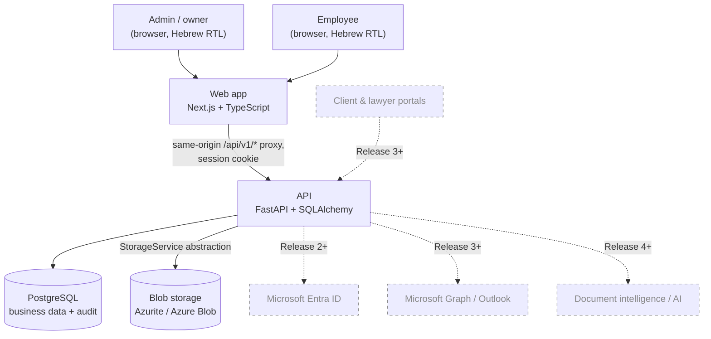
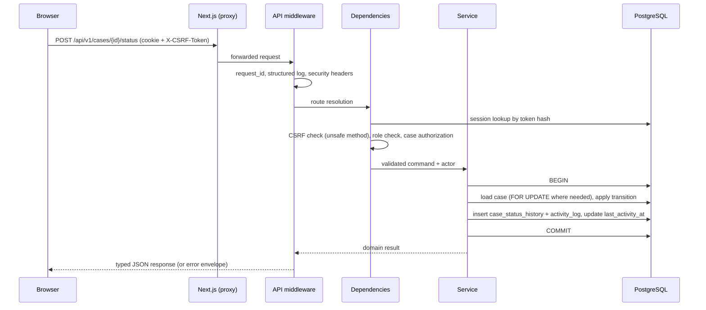
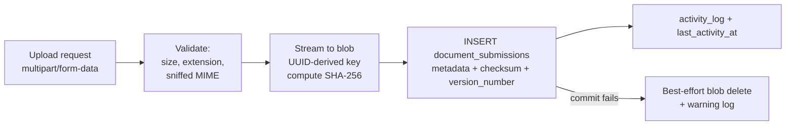

# Architecture

> **Status:** Planning. Release 1 is not implemented yet. Sections describe the agreed target design.
> This document is updated at the end of every implementation phase to match the code.
> Last reviewed: 2026-09-01

## 1. Purpose and constraints

The platform is the internal system of record for actuarial/financial consultancy cases. Release 1
builds the operational foundation; later releases add portals, payments, Microsoft 365 integration,
document intelligence and AI features. The architecture is therefore optimised for:

1. **Correctness** — invariants enforced in the database and in one service layer, not in controllers.
2. **Security** — every access decision is made server-side, defence in depth on uploads and sessions.
3. **Auditability** — an append-only business audit trail written in the same transaction as the change.
4. **Maintainability** — explicit layers with a single direction of dependency.
5. **Extensibility** — abstractions at exactly the boundaries we know will change (identity, storage,
   workflow transitions), and nowhere else.

Non-goals for Release 1: multi-tenancy, horizontal scale beyond a handful of concurrent internal
users, offline support, public endpoints of any kind.

## 2. System context



Only the solid arrows are in Release 1 scope. The dashed elements exist in this diagram to document
where they attach: identity through the authentication provider abstraction (§6), documents through
the storage abstraction (§8), and everything else through new API modules that reuse the same service
and audit layers.

## 3. Runtime topology

### Local development (Docker Compose)

| Service | Image / build | Port | Notes |
| --- | --- | --- | --- |
| `db` | `postgres` (pinned minor) | 5432 | Named volume, `pg_trgm` extension enabled by migration |
| `azurite` | `mcr.microsoft.com/azure-storage/azurite` | 10000 | Blob endpoint only; well-known dev credentials |
| `api` | `infra/docker/api.Dockerfile` | 8000 | Alembic `upgrade head` on start in dev only |
| `web` | `infra/docker/web.Dockerfile` | 3000 | Proxies `/api/v1/*` to `api` so cookies stay first-party |

The browser only ever talks to the web origin. This is what makes `SameSite=Lax` session cookies work
without `SameSite=None`, and it is the same shape we deploy in production (ADR-0005).

### Production target (Release 1+, not deployed in Release 1)

Two container images (`web`, `api`) on Azure Container Apps behind a single hostname with path-based
routing (`/api/*` → api, everything else → web); Azure Database for PostgreSQL Flexible Server with
TLS enforced; Azure Blob Storage with private containers only; Azure Key Vault as the source of
secrets, surfaced to the containers as environment variables; Application Insights / Azure Monitor
for logs, traces and availability. No code in the application reads Key Vault or Azure Monitor
directly — configuration always arrives as environment variables (ADR-0020) and telemetry is emitted
through OpenTelemetry-compatible logging (§10).

## 4. Backend layering

```text
apps/api/app/
  main.py            FastAPI app factory, middleware, exception handlers, routers
  api/               HTTP layer: routers, dependencies, request/response wiring only
  schemas/           Pydantic v2 request/response models (the public contract)
  services/          Use cases: transaction boundary, orchestration, audit + activity emission
  repositories/      Query/persistence encapsulation, including actor-scoped queries
  models/            SQLAlchemy ORM mappings
  domain/            Pure logic: enums, status-transition graph, invariants, value objects
  db/                Engine, session factory, unit of work, base metadata, migrations env
  auth/              Password hashing, session handling, identity providers, policies
  storage/           StorageService protocol + Azure Blob adapter + test fake
  audit/             Audit recorder and action catalogue
  core/              Settings, logging, errors, pagination, time, request context
  tests/             unit / integration / factories
```

Dependency rules (verified in CI by an `import-linter` contract from Phase 1 onward):

| Layer | May import | Must never import |
| --- | --- | --- |
| `api` | `schemas`, `services`, `auth`, `core`, `domain` | `repositories`, `models` directly |
| `services` | `repositories`, `models`, `domain`, `audit`, `storage`, `core` | `fastapi`, `api`, `schemas` |
| `repositories` | `models`, `domain`, `core`, `db` | `services`, `api`, `schemas` |
| `domain` | `core` (types only) | `sqlalchemy`, `fastapi`, `repositories`, `services` |
| `storage`, `audit` | `core`, `models` (audit only), `domain` | `api`, `services` |

Practical consequences:

- Routers contain no business rules and no queries. They validate input, resolve dependencies
  (current user, authorized case), call one service method, and return a typed response model.
- Services own the transaction and are the only place that may change state. Any state change that is
  "meaningful" (§7) emits an audit event and touches `last_activity_at` in the same transaction.
- `domain` is importable from tests without a database, which is where the status-transition graph,
  the Israeli ID checksum, and case-number formatting are unit-tested.
- Raw ORM objects never leave the service layer; responses are always Pydantic models.

`repositories` exists for a concrete reason, not ceremony: employee visibility is enforced by
*scoping queries*, not by post-filtering. `CaseRepository.list_for_actor(actor, filters)` adds the
`EXISTS (SELECT 1 FROM case_assignments …)` predicate for `EMPLOYEE` actors, so a forgotten check in a
list endpoint cannot leak rows (ADR-0013). Trivial entities are allowed to have thin repositories;
we do not create a repository per table for its own sake.

## 5. Request lifecycle



Middleware order (outermost first): request context/ID → structured access log → security headers →
CORS (dev only, strict allowlist) → body-size guard → router. Exception handlers translate domain
errors into the error envelope defined in [`api.md`](api.md); unhandled exceptions are logged with the
`request_id` and returned as a generic 500 with no stack trace or internal detail.

### Transaction boundary

One `AsyncSession` per request, created by a FastAPI dependency. The **service method** is the
transaction boundary: it opens a transaction, performs all writes (including audit rows), and commits.
Repositories never commit. Routers never commit. This guarantees the property the specification
requires — that audit history cannot diverge from the data it describes — because a rollback discards
both. Read-only requests run in a transaction that is rolled back at the end.

Optimistic concurrency: `Case` and `DocumentRequirement` carry a `version` column mapped as
SQLAlchemy's `version_id_col`. Clients send the version they read; a mismatch returns `409` rather
than silently overwriting a colleague's edit (ADR-0019).

## 6. Authentication and authorization architecture

Authentication is split into three replaceable pieces so that adding Entra ID later is additive:

1. **Identity storage** — `user_identities` rows link a `User` to `(provider, provider_subject)`.
   Release 1 creates `PASSWORD` identities holding an Argon2id hash. An Entra ID login later inserts a
   `MICROSOFT_ENTRA` identity for the same user with no schema change to `users`.
2. **`AuthenticationProvider` protocol** — `authenticate(credentials) -> AuthenticatedIdentity`.
   Release 1 ships `PasswordAuthenticationProvider`. An `EntraIdAuthenticationProvider` implements the
   same protocol with an OIDC code flow.
3. **Session issuance** — provider-independent. A successful authentication of any kind produces a
   server-side session (§ `security.md`), so the session, CSRF, logout and revocation logic is written
   once.

Authorization is a dedicated policy module (`auth/policies.py`) invoked from routers via dependencies
and from services for defence in depth. Three mechanisms, used deliberately:

- **Role gates** — `require_role(Role.ADMIN)` for admin-only endpoints (user management, archiving,
  global audit).
- **Object policies** — `ensure_can_view_case`, `ensure_can_edit_case`, `ensure_can_archive_case`,
  `ensure_can_review_document`. Pure functions over `(actor, case_access)`.
- **Query scoping** — actor-scoped repository methods for every list/aggregate query (ADR-0013).

Hiding a button in the UI is never an authorization mechanism; the web app hides controls purely for
usability and every corresponding endpoint enforces the same rule independently, with tests asserting
it (see [`roadmap.md`](roadmap.md) exit criteria).

## 7. Case workflow, activity and audit

**Status transitions** go through a single `CaseWorkflowService.change_status(...)` backed by a
declarative graph in `domain/case_workflow.py`. Nothing else in the codebase may assign `Case.status`.
Every transition writes a `case_status_history` row (append-only) and an audit event. Because the
graph and the service are the only entry point, later automation (a scheduler, an inbound email
handler, an AI agent) calls the same method and inherits the same validation, history and audit
behaviour. See [`open-questions.md`](open-questions.md) Q3 for the one open decision: how strictly the
graph is enforced in Release 1.

**Audit** (`audit/recorder.py`) is bound to the request's session and used by services:
`recorder.record(action=..., entity=..., case_id=..., description=..., metadata=..., changes=...)`.
Rows land in `activity_log` in the same transaction. `UPDATE`/`DELETE` on that table is blocked by a
database trigger, so "immutable through normal application operations" is enforced by PostgreSQL, not
by convention (ADR-0010). Application logs are for operators; they are never the business history.

**`last_activity_at`** is updated only by an explicit allowlist of meaningful actions, resolved from
the audit action in one place (`domain/activity.py`). Reads never touch it — including document
downloads, which are audited for accountability but are not activity. The staleness threshold is the
configuration value `CASE_INACTIVITY_THRESHOLD_DAYS` (default `14`), read from settings wherever
"stuck" is computed; the number 14 appears exactly once in the codebase, in the settings default.

## 8. Document storage architecture



- `StorageService` is a `Protocol` with `put_stream`, `open_stream`, `delete`, `exists`. Adapters:
  `AzureBlobStorageService` (Azurite in dev, Azure Blob in production, same code path) and
  `InMemoryStorageService` for tests. Services depend on the protocol only; no Azure SDK type appears
  outside `storage/` (ADR-0012).
- Storage keys are derived exclusively from server-generated UUIDs — the layout is
  `cases/<case_id>/requirements/<requirement_id>/<submission_id>` — so the key is stable, collision-free
  and traceable back to its case. User-supplied filenames are stored as metadata and used only,
  sanitised, in the `Content-Disposition` header on download. There is no code path where a
  client-supplied string reaches a blob path.
- Files are never overwritten. A new upload for the same requirement creates a new
  `document_submissions` row with the next `version_number` and its own key.
- Downloads stream through the API after authorization, so no blob URL or SAS token is ever handed to
  a browser in Release 1. Direct-to-blob upload/download with short-lived user-delegation SAS is a
  deliberate later optimisation for large files.
- Ordering is blob-first, then the database row, with best-effort cleanup on commit failure. The
  alternative (row first) can produce a database row pointing at a missing file, which is worse: it
  breaks a user-visible promise instead of leaving an unreferenced blob. Unreferenced blobs are
  detectable by a reconciliation script (Phase 9) and cost nothing but storage.

## 9. Frontend architecture

```text
apps/web/src/
  app/                      App Router: (auth)/login, (app)/dashboard, cases, people, ...
  components/ui/            shadcn/ui primitives (generated, RTL-verified)
  components/               Shared presentational components
  features/<feature>/       Feature slices: components, hooks, queries, schemas
  lib/api/                  Typed fetch client + generated OpenAPI types + error mapping
  lib/                      Formatting (dates, numbers), utils, constants
  messages/he.ts            Single Hebrew message catalog, accessed through t()
  types/                    Shared domain-facing TS types
  hooks/                    Cross-feature hooks
```

- **Typed contract, no drift.** `lib/api/schema.d.ts` is generated from the API's OpenAPI document by
  `openapi-typescript` and checked in; CI regenerates it and fails if it differs. Request/response
  types are derived from it, so a backend contract change breaks the frontend build rather than
  production (ADR-0017).
- **No business logic in components.** Server calls live in feature `queries.ts` modules on top of
  TanStack Query; forms use `react-hook-form` + `zod`; derived display logic lives in feature hooks or
  `lib/`. Components render props and dispatch callbacks.
- **RTL first.** `<html lang="he" dir="rtl">`, Tailwind logical properties (`ms-*`, `me-*`, `ps-*`,
  `pe-*`, `text-start`, `text-end`) rather than physical `left/right`, and a Hebrew-capable font loaded
  via `next/font`. shadcn/Radix primitives receive `dir="rtl"` through a provider.
- **Hebrew copy in one place.** All strings — labels, statuses, case types, participant roles, error
  messages, empty states — come from `messages/he.ts` via a `t()` helper. No hardcoded Hebrew in JSX.
  API error `code` values are mapped to Hebrew messages by a single mapper. Swapping in `next-intl`
  later touches the helper and the catalog, not the features (ADR-0018).
- **Dates.** All instants arrive as UTC ISO-8601 and are rendered with
  `Intl.DateTimeFormat('he-IL', { timeZone: 'Asia/Jerusalem' })`. Business dates
  (deadlines, appointment/separation dates) are date-only strings and are never passed through a
  timezone conversion (ADR-0015). "This week" means Sunday→Saturday, Jerusalem time.
- **Route protection is UX only.** Next.js middleware redirects to `/login` when the session cookie is
  absent, and the protected layout server-side-fetches `GET /api/v1/auth/me` and redirects on 401.
  Neither is a security control; the API enforces everything.

## 10. Configuration, secrets and observability

- **Configuration** is a single `pydantic-settings` `Settings` object, populated from environment
  variables, with no defaults that would be unsafe in production (for example, the app refuses to
  start with a missing/weak `SESSION_SECRET` when `APP_ENV=production`). `.env.example` documents every
  variable with a safe placeholder; real values never enter the repository.
- **Secrets** in production come from Key Vault via the platform's secret injection, so the code path
  is identical to local development. No Azure SDK dependency for configuration (ADR-0020).
- **Logging** is structured JSON (`structlog`) with `request_id`, `user_id`, route, status and duration.
  PII and file contents are never logged; audit is the place for business facts. Log fields are chosen
  so an Application Insights / OpenTelemetry exporter can be added without touching call sites.
- **Health** endpoints: `GET /healthz` (process liveness, no dependencies) and `GET /readyz`
  (database connectivity, and storage reachability in production), both unauthenticated and
  information-free.

## 11. Testing architecture

| Level | Tooling | Scope |
| --- | --- | --- |
| Unit (API) | `pytest` | `domain` logic: transition graph, activity allowlist, ID checksum, number formatting, policies |
| Integration (API) | `pytest` + `httpx` ASGI transport + real PostgreSQL | Every endpoint, every authorization rule, every invariant, migrations |
| Component (web) | Vitest + React Testing Library | Components and hooks with a mocked API client |
| E2E | Playwright against the Compose stack | The Release 1 critical flow end to end |

Integration tests run against a dedicated test database created by `alembic upgrade head` — never
`create_all` — so migrations are exercised on every run. Each test runs inside a transaction that is
rolled back afterwards, except the case-numbering concurrency test, which deliberately uses
independent sessions and real commits to prove that parallel case creation cannot produce duplicate
numbers. Storage is exercised through `InMemoryStorageService` in tests, with one Azurite-backed test
for the Azure adapter itself.

The authorization tests listed in the specification (§24) are treated as release-blocking, not
optional: unauthenticated rejection, employee cannot reach an unassigned case, employee cannot
archive, admin can, duplicate case numbers impossible, submission history preserved, re-submission
after rejection works, status history preserved, audit event written for every meaningful operation.

## 12. Quality gates

Enforced locally via `scripts/` (or a `Makefile`) and identically in CI:

- API: `ruff format --check`, `ruff check`, `mypy` (strict on `domain`, `services`, `schemas`),
  `import-linter`, `pytest` with coverage on the layers that matter.
- Web: `eslint`, `prettier --check`, `tsc --noEmit` with `strict: true` and no `any` escapes,
  `vitest run`, and the generated-OpenAPI-types freshness check.
- Migrations: a check that the models and the migration head agree (Alembic autogenerate produces an
  empty diff), so a model change without a migration fails CI.

## 13. Known architectural risks

| Risk | Mitigation |
| --- | --- |
| Streaming uploads/downloads through the API limits file size and consumes API bandwidth | Configurable size ceiling in Release 1; SAS-based direct transfer is a contained, later change behind `StorageService` |
| Per-year counter row serialises concurrent case creation | Acceptable at this scale (single small firm); the unique constraint is the real guarantee |
| Opaque sessions add a database read per request | Trivially cheap on an indexed hash lookup; a cache can be added behind the session store if it ever matters |
| Employee visibility is assignment-based only | Deliberate; broader sharing (team/department, explicit grants) is an additive table plus a change in one repository predicate |
| Audit `changes` payloads could accumulate PII | Field-level allowlist and redaction policy defined in [`security.md`](security.md) |
