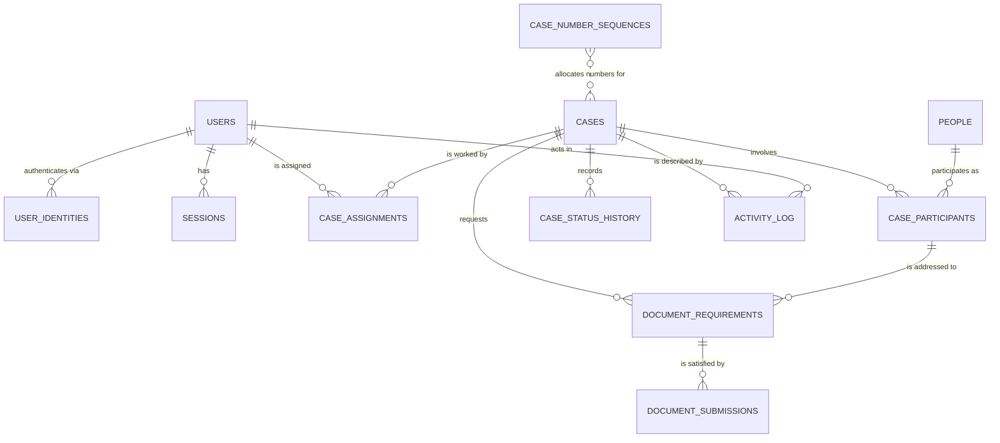
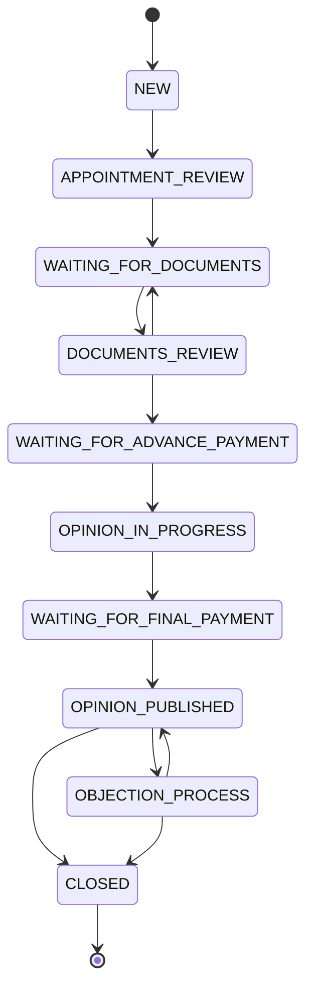

# Domain model

> **Status:** Four tables exist. Revision `0001` created `users`, `user_identities`, `sessions` and
> `activity_log` (§3, §7) and enabled `pg_trgm`; each is marked **IMPLEMENTED** below. Everything else
> — `people`, `cases`, participants, assignments, status history, document requirements and
> submissions, `case_number_sequences` — is **PLANNED**: the schema later phases will create through
> Alembic. Items marked **(open)** depend on an answer in
> [`open-questions.md`](open-questions.md).
>
> After Phase 2 those four tables are **live**: the application writes `users` and `user_identities`
> through admin provisioning and the bootstrap CLI, issues and revokes `sessions` on every login,
> logout, password change, reset and deactivation, and records authentication and user-administration
> events in `activity_log`. Phase 2 added **no new tables, columns, indexes or constraints** — the
> Phase 1 schema already carried everything it needed, including the lockout counters on
> `user_identities` and the CSRF hash on `sessions` — so there is no migration beyond `0001`, and the
> model-versus-migration drift test confirms it.
> Last reviewed: 2026-09-06

## 1. Overview



Two ideas carry most of the design:

1. **Nothing about a case is positional.** There is no `client_1`, `lawyer_2` or `employee_id`.
   People reach a case through `case_participants` (role-typed, many per role), and staff reach it
   through `case_assignments` (many per case, at most one `PRIMARY`).
2. **Requests are separate from artefacts.** `document_requirements` is what we asked for;
   `document_submissions` is what arrived. A requirement accumulates an immutable, versioned chain of
   submissions, so "rejected twice, approved on the third try" is a first-class, queryable fact.

## 2. Conventions

- **Primary keys** are `UUID` (v4, generated in the application) for every entity.
- **Business keys** are separate and unique (`cases.internal_case_number`, `users.email`).
- **Instants** are `TIMESTAMPTZ`, stored in UTC. **Business dates** (deadlines, appointment date,
  separation date, due dates) are `DATE` — a court deadline is a calendar day, not a moment, and must
  not shift with a timezone (ADR-0015).
- **Enumerations** are `TEXT` columns with `CHECK` constraints, mirrored by Python `StrEnum` and
  validated by Pydantic. Native PostgreSQL enums are avoided because several of these value sets are
  explicitly expected to grow, and `ALTER TYPE` is a worse migration story than editing a check
  constraint (ADR-0018 covers labels; ADR-0023 covers this choice).
- **Timestamps**: every table has `created_at`; mutable tables have `updated_at`; archivable business
  entities have `archived_at` (`NULL` = active).
- **Foreign keys** use `ON DELETE RESTRICT`. Nothing important is deletable (§8).
- **Naming**: `snake_case`, plural table names, `<entity>_id` foreign keys, English throughout.
- Alembic uses an explicit naming convention for constraints and indexes (`pk_`, `fk_`, `uq_`, `ck_`,
  `ix_`) so autogenerated migrations are stable and reviewable. It is declared once, on
  `Base.metadata` in `app/db/base.py`, and Alembic compares against that same metadata — which is why
  a migration writes `name="email_normalized"` and the database ends up with
  `ck_users_email_normalized`. Naming a constraint with its prefix already attached produces
  `ck_users_ck_users_…` and a permanent phantom diff.

## 3. Identity and access tables — IMPLEMENTED

Revision `0001` created all three tables in this section. No application code writes to them yet.

### `users`

Internal staff accounts. Clients and lawyers are **not** users in Release 1 — they are `people`.

| Column | Type | Null | Notes |
| --- | --- | --- | --- |
| `id` | UUID | no | PK |
| `email` | TEXT | no | Unique; stored lower-cased/trimmed; login identifier |
| `full_name` | TEXT | no | Display name (Hebrew content, English column name) |
| `role` | TEXT | no | `ADMIN` \| `EMPLOYEE` (check constraint) |
| `must_change_password` | BOOLEAN | no | Default `TRUE` for admin-provisioned accounts (decided; ADR-0026) |
| `last_login_at` | TIMESTAMPTZ | yes | Set on successful authentication |
| `deactivated_at` | TIMESTAMPTZ | yes | `NOT NULL` ⇒ cannot log in; row is retained for history |
| `created_by` | UUID → `users.id` | yes | `NULL` only for the bootstrap admin |
| `created_at` / `updated_at` | TIMESTAMPTZ | no | |

A single `role` column is sufficient for two roles. When `CLIENT`/`LAWYER` portals arrive, roles move
to a `user_roles` table; because all checks go through `auth/policies.py`, that is an additive
migration plus one module change, not a sweep of the codebase.

Two check constraints back the prose above with something the database enforces:
`email = lower(btrim(email)) AND email <> ''`, so "normalised by application rules" cannot quietly
stop being true, and `btrim(full_name) <> ''`, because a blank display name is not a name. `created_by`
is a self-referencing foreign key, nullable only for the bootstrap admin Phase 2 creates.

### `user_identities`

One row per (user, identity provider). This is what makes Entra ID additive.

| Column | Type | Null | Notes |
| --- | --- | --- | --- |
| `id` | UUID | no | PK |
| `user_id` | UUID → `users.id` | no | |
| `provider` | TEXT | no | `PASSWORD` \| `MICROSOFT_ENTRA` (only `PASSWORD` used in Release 1) |
| `provider_subject` | TEXT | no | Normalised email for `PASSWORD`; the IdP's stable object id later |
| `secret_hash` | TEXT | yes | Argon2id encoded hash; `NULL` for federated providers |
| `secret_updated_at` | TIMESTAMPTZ | yes | Enables future password-age policy |
| `failed_attempt_count` | INTEGER | no | Default 0; reset on success |
| `locked_until` | TIMESTAMPTZ | yes | Set by the lockout policy in [`security.md`](security.md) |
| `created_at` / `updated_at` | TIMESTAMPTZ | no | |

Constraints: `UNIQUE (provider, provider_subject)`, `UNIQUE (user_id, provider)`,
`CHECK (provider <> 'PASSWORD' OR secret_hash IS NOT NULL)`,
`CHECK (provider IN ('PASSWORD', 'MICROSOFT_ENTRA'))`, `CHECK (failed_attempt_count >= 0)`. Index on
`(user_id)` for "every identity of this user".

### `sessions`

Server-side sessions; the cookie carries an opaque random token, the table stores only its hash.

| Column | Type | Null | Notes |
| --- | --- | --- | --- |
| `id` | UUID | no | PK |
| `user_id` | UUID → `users.id` | no | |
| `token_hash` | TEXT | no | Unique; SHA-256 of a 256-bit random token |
| `csrf_token_hash` | TEXT | no | Binds the double-submit CSRF token to this session |
| `issued_at` | TIMESTAMPTZ | no | |
| `last_seen_at` | TIMESTAMPTZ | no | Drives idle timeout; updated at most once per minute |
| `expires_at` | TIMESTAMPTZ | no | Absolute lifetime **(open: Q10 for the exact values)** |
| `revoked_at` | TIMESTAMPTZ | yes | Set by logout, password change, or deactivation |
| `updated_at` | TIMESTAMPTZ | no | |
| `user_agent` | TEXT | yes | Truncated |
| `ip_address` | INET | yes | For audit of authentication events |

Indexes and constraints: `UNIQUE (token_hash)` is the login-path lookup; `(user_id, revoked_at)`
serves "revoke all sessions of a user"; `(expires_at)` serves the pruning job; and
`CHECK (expires_at > issued_at)` rejects a session that was dead when it was created.

`issued_at` is the creation instant, so there is deliberately no separate `created_at` — two columns
that would always hold the same value are two columns that can eventually disagree. `updated_at` is
kept because rows are mutated (`last_seen_at`, `revoked_at`), which is the general rule in §2.

## 4. People

### `people`

A real human or organisational contact: a party to a case, a lawyer, an accountant, a court contact.
A person exists **once** and is reused across cases — a lawyer appearing in thirty cases is one row.
A lawyer is simply a person with `organization_name` / `license_number` populated; there is no
separate lawyer table and no role stored on the person, because role is a property of participation.

| Column | Type | Null | Notes |
| --- | --- | --- | --- |
| `id` | UUID | no | PK |
| `first_name` / `last_name` | TEXT | no | |
| `id_number` | TEXT | yes | Israeli ID; unique when present **(open: Q7)** |
| `email` | TEXT | yes | Not unique — spouses and family members legitimately share addresses |
| `phone` | TEXT | yes | Stored as entered, normalised for search |
| `address` | TEXT | yes | |
| `workplace` | TEXT | yes | |
| `organization_name` | TEXT | yes | Law firm / employer / municipality |
| `license_number` | TEXT | yes | Bar or professional licence |
| `notes` | TEXT | yes | |
| `created_by` | UUID → `users.id` | no | |
| `created_at` / `updated_at` | TIMESTAMPTZ | no | |
| `archived_at` | TIMESTAMPTZ | yes | Hidden from pickers; historical references keep working |

Indexes: partial `UNIQUE (id_number) WHERE id_number IS NOT NULL`; `pg_trgm` GIN indexes on
`first_name`, `last_name`, `organization_name`, `id_number` for substring search. Hebrew has no case
distinction, so `ILIKE '%…%'` over trigram indexes is the right Release 1 search (ADR-0024).

## 5. Cases

### `cases`

| Column | Type | Null | Notes |
| --- | --- | --- | --- |
| `id` | UUID | no | PK; the identifier used in API paths |
| `internal_case_number` | TEXT | no | Unique; `YYYY-NNNN`; check constraint `^\d{4}-\d{4}$` |
| `court_case_number` | TEXT | yes | Not unique — related cases can share it; indexed for lookup |
| `case_name` | TEXT | no | Human label, typically "פלוני נ' פלונית" |
| `case_type` | TEXT | no | See §5.2 |
| `status` | TEXT | no | See §5.3; default `NEW` |
| `appointment_date` | DATE | yes | Court appointment of the expert |
| `separation_date` | DATE | yes | Actuarially significant date (מועד הקרע) |
| `submission_deadline` | DATE | yes | Opinion submission deadline |
| `notes` | TEXT | yes | |
| `last_activity_at` | TIMESTAMPTZ | no | Set at creation; updated by meaningful actions only (§7) |
| `version` | INTEGER | no | Optimistic concurrency token (ADR-0019) |
| `created_by` | UUID → `users.id` | no | |
| `created_at` / `updated_at` | TIMESTAMPTZ | no | |
| `archived_at` | TIMESTAMPTZ | yes | Orthogonal to `status`; no hard delete ever (ADR-0025) |

Indexes: `UNIQUE (internal_case_number)`; `(status)`; `(submission_deadline)`;
`(last_activity_at)`; `(case_type)`; `(archived_at)`; trigram index on `case_name`; and a composite
index supporting the dashboard's default ordering.

**Archival is orthogonal to status** (decided; ADR-0025). `archived_at` is the single source of truth
for "is this case in the working set". `ARCHIVED` is deliberately **not** a status value, so `status`
always retains its real workflow meaning: an archived case still says whether it ended at
`OPINION_PUBLISHED` or `CLOSED`, which the specification's original enum would have destroyed.
Archiving and unarchiving are performed only by `CaseService`, are `ADMIN`-only, are audited, and never
touch `status`.

### 5.1 Internal case number generation

Requirements: format `YYYY-NNNN`, per-calendar-year sequence, concurrency-safe, and no
`MAX(number)+1`.

```sql
-- table
CREATE TABLE case_number_sequences (
    year        INTEGER PRIMARY KEY,
    last_value  INTEGER NOT NULL CHECK (last_value >= 0),
    updated_at  TIMESTAMPTZ NOT NULL
);

-- allocation, executed inside the case-creation transaction
INSERT INTO case_number_sequences (year, last_value, updated_at)
VALUES (:year, 1, now())
ON CONFLICT (year)
DO UPDATE SET last_value = case_number_sequences.last_value + 1,
              updated_at = now()
RETURNING last_value;
```

Why this and not alternatives:

- A single atomic statement handles both "first case of the year" and "nth case of the year".
- Concurrent transactions serialise on the year's row lock, so two callers cannot receive the same
  value. The `UNIQUE` constraint on `internal_case_number` is the final backstop.
- Unlike a PostgreSQL `SEQUENCE`, a rolled-back case creation **returns** the number instead of
  burning it, so numbering stays gapless — which matters when the number appears in court documents.
- No runtime DDL (which per-year sequences would require) and no advisory-lock bookkeeping.

The formatted number is produced by `domain/case_number.py` (`format_case_number(year, value)`), which
is unit-tested without a database, and the year comes from the request time in `Asia/Jerusalem` so a
case created on 31 December at 23:30 local time gets that year's number. Concurrency is covered by an
integration test that creates cases from parallel sessions and asserts a contiguous, duplicate-free
set.

**This numbering scheme is introduced by this application.** The business has no internal case
numbering system today, so there are no pre-existing internal numbers to preserve, accommodate or
collide with, and `case_number_sequences` is **not** seeded from historical data. Cases imported from
Excel in Phase 8 receive a fresh `internal_case_number` from the same allocator as any other case;
`court_case_number` is imported where the export contains one. Which year an imported case draws its
number from, and whether the spreadsheet holds an identifier worth retaining separately for
traceability, are part of the import mapping still **(open: Q8)** pending a real Excel export.

### 5.2 `case_type`

`RESOURCE_BALANCING`, `BUSINESS_VALUATION`, `DAMAGES_ACTUARIAL`, `FINANCIAL_DISPUTE`,
`MUNICIPAL_FINANCIAL_GUIDANCE`, `OTHER`.

Release 1 stores the type, uses it for filtering and display, and — importantly — resolves workflow
validation from it. The status set in §5.3 is shared by all types, but only `RESOURCE_BALANCING` has a
defined business process today, so only that type has its transitions constrained by a graph. Every
other type uses an open policy in Release 1: any status may follow any status, while still passing
through `CaseWorkflowService` for authorization, status history and audit (ADR-0009).

This is a policy registry keyed by `case_type`, not a workflow engine per type. Defining a real process
for `BUSINESS_VALUATION` later means adding a graph and one registry entry; no schema change, no new
service, no API change.

### 5.3 `status`

`NEW`, `APPOINTMENT_REVIEW`, `WAITING_FOR_DOCUMENTS`, `DOCUMENTS_REVIEW`,
`WAITING_FOR_ADVANCE_PAYMENT`, `OPINION_IN_PROGRESS`, `WAITING_FOR_FINAL_PAYMENT`,
`OPINION_PUBLISHED`, `OBJECTION_PROCESS`, `CLOSED`.

`ARCHIVED` from the specification's list is intentionally absent: archival is the separate `archived_at`
flag described above, and `CLOSED` is the terminal workflow state (ADR-0025).

The two payment-waiting statuses are **operational signals only** in Release 1: they mark that the
team is waiting for money, and there is no payment, invoice or amount entity anywhere in the schema
(payments are out of scope). Recording them costs nothing and preserves the real workflow; treating
them as financial data would not.

Canonical resource-balancing path. This graph is enforced **only** for `case_type =
RESOURCE_BALANCING`; other types accept any transition in Release 1 (ADR-0009):



Archiving is not shown because it is not a transition: a case in any status can be archived, and
archiving leaves `status` unchanged.

### `case_status_history`

Append-only; one row per transition, including the initial `NULL → NEW`.

| Column | Type | Null | Notes |
| --- | --- | --- | --- |
| `id` | UUID | no | PK |
| `case_id` | UUID → `cases.id` | no | |
| `from_status` | TEXT | yes | `NULL` for case creation |
| `to_status` | TEXT | no | |
| `changed_by` | UUID → `users.id` | no | |
| `changed_at` | TIMESTAMPTZ | no | |
| `reason` | TEXT | yes | Mandatory for an `ADMIN` out-of-graph override on a graph-governed case type; optional otherwise (ADR-0009) |

Index `(case_id, changed_at DESC)`. `UPDATE`/`DELETE` blocked by trigger.

### `case_participants`

| Column | Type | Null | Notes |
| --- | --- | --- | --- |
| `id` | UUID | no | PK |
| `case_id` | UUID → `cases.id` | no | |
| `person_id` | UUID → `people.id` | no | |
| `role` | TEXT | no | `PARTY_A`, `PARTY_B`, `LAWYER_PARTY_A`, `LAWYER_PARTY_B`, `OTHER` |
| `added_by` / `added_at` | UUID, TIMESTAMPTZ | no | |
| `removed_by` / `removed_at` | UUID, TIMESTAMPTZ | yes | Soft removal; no hard delete exists (ADR-0029) |

Constraints and indexes: partial `UNIQUE (case_id, person_id, role) WHERE removed_at IS NULL`
(the same person may hold two different roles, and may be re-added after removal);
`UNIQUE (case_id, id)` so that `document_requirements` can use a composite foreign key (§6);
indexes on `(case_id)` and `(person_id)`.

Any number of participants may share a role — two lawyers for party A is expressible without schema
change, which is exactly what the specification demands. A `represents_participant_id` self-reference
(explicitly linking a lawyer to the party they represent) is intentionally **not** added yet; the role
values carry that information for Release 1 and the column can be added additively if a case ever
needs finer granularity.

### `case_assignments`

| Column | Type | Null | Notes |
| --- | --- | --- | --- |
| `id` | UUID | no | PK |
| `case_id` | UUID → `cases.id` | no | |
| `user_id` | UUID → `users.id` | no | |
| `is_primary` | BOOLEAN | no | Default `FALSE` |
| `assigned_by` / `assigned_at` | UUID, TIMESTAMPTZ | no | |
| `removed_by` / `removed_at` | UUID, TIMESTAMPTZ | yes | Soft removal preserves "who worked this case" |

Constraints: partial `UNIQUE (case_id, user_id) WHERE removed_at IS NULL`; partial
`UNIQUE (case_id) WHERE is_primary AND removed_at IS NULL` — the database, not the service, guarantees
at most one primary. Index `(user_id, case_id) WHERE removed_at IS NULL` powers every employee-scoped
query, which is the hottest access path in the system.

This table **is** the employee authorization boundary: an `EMPLOYEE` may act on a case if and only if
an active assignment row exists.

## 6. Documents

### `document_requirements` — "what we asked for"

| Column | Type | Null | Notes |
| --- | --- | --- | --- |
| `id` | UUID | no | PK |
| `case_id` | UUID → `cases.id` | no | |
| `case_participant_id` | UUID | yes | Who must provide it; composite FK `(case_id, case_participant_id)` → `case_participants (case_id, id)` |
| `title` | TEXT | no | Hebrew content, e.g. "דוח מסלקה פנסיונית" |
| `document_type` | TEXT | no | See §6.1 |
| `description` | TEXT | yes | |
| `is_required` | BOOLEAN | no | Default `TRUE`; `FALSE` = nice-to-have |
| `due_date` | DATE | yes | |
| `status` | TEXT | no | **(open: Q5)** — value set and whether it is derived from submissions |
| `version` | INTEGER | no | Optimistic concurrency token |
| `created_by` | UUID → `users.id` | no | |
| `created_at` / `updated_at` | TIMESTAMPTZ | no | |
| `archived_at` | TIMESTAMPTZ | yes | A cancelled request keeps its submission history |

The composite foreign key is deliberate: it makes it structurally impossible to attach a requirement
to a participant of a *different* case, a class of cross-case data leak that application-level checks
tend to miss.

Indexes: `(case_id, status)`, `(due_date)`, `(case_participant_id)`.

### 6.1 `document_type`

Starting set: `PENSION_CLEARINGHOUSE_REPORT`, `SALARY_SLIP`, `BANK_STATEMENT`, `TAX_ASSESSMENT`,
`PENSION_FUND_STATEMENT`, `INSURANCE_POLICY`, `PROPERTY_DOCUMENT`, `COURT_DECISION`,
`MARRIAGE_OR_DIVORCE_CERTIFICATE`, `IDENTIFICATION`, `OTHER`. Hebrew labels live in the web message
catalog. The list is expected to grow, which is why it is a checked `TEXT` column and not a PG enum;
the exact starting list should be confirmed with the business owner (Q9).

### `document_submissions` — "what actually arrived"

| Column | Type | Null | Notes |
| --- | --- | --- | --- |
| `id` | UUID | no | PK |
| `requirement_id` | UUID → `document_requirements.id` | no | |
| `version_number` | INTEGER | no | 1, 2, 3 …; `UNIQUE (requirement_id, version_number)` |
| `status` | TEXT | no | `UPLOADED`, `UNDER_REVIEW`, `APPROVED`, `REJECTED` (+ `SUPERSEDED`, open: Q5) |
| `storage_key` | TEXT | no | Unique; server-generated, UUID-derived |
| `original_filename` | TEXT | no | As uploaded; used only in `Content-Disposition`, sanitised |
| `content_type` | TEXT | no | Sniffed and validated, not trusted from the client |
| `byte_size` | BIGINT | no | `CHECK (byte_size > 0)` |
| `checksum_sha256` | TEXT | no | Computed while streaming; integrity and future de-duplication |
| `uploaded_by` / `uploaded_at` | UUID, TIMESTAMPTZ | no | |
| `reviewed_by` / `reviewed_at` | UUID, TIMESTAMPTZ | yes | |
| `review_notes` | TEXT | yes | |

Constraints:

- `CHECK (status NOT IN ('APPROVED','REJECTED') OR (reviewed_by IS NOT NULL AND reviewed_at IS NOT NULL))`
  — a decision always has an author and a time.
- A trigger rejects any `UPDATE` that modifies `storage_key`, `checksum_sha256`, `byte_size`,
  `original_filename`, `version_number` or `uploaded_*`. Review fields and `status` remain mutable.
  Rows are never deleted. This is how "never overwrite the prior submission file" becomes a database
  guarantee rather than a code-review promise.
- `version_number` is allocated inside the same transaction using the same counter pattern as case
  numbers (`SELECT … FOR UPDATE` on the parent requirement row), so two simultaneous uploads cannot
  collide.

Worked example — the specification's scenario is directly representable:

| requirement | submission | status | file |
| --- | --- | --- | --- |
| דוח מסלקה פנסיונית | v1 | `REJECTED` | preserved |
| | v2 | `REJECTED` | preserved |
| | v3 | `APPROVED` | preserved |

## 7. Activity and audit — IMPLEMENTED

### `activity_log`

One append-only table serves both the business audit trail and the per-case activity timeline.

| Column | Type | Null | Notes |
| --- | --- | --- | --- |
| `id` | UUID | no | PK |
| `occurred_at` | TIMESTAMPTZ | no | |
| `actor_user_id` | UUID → `users.id` | yes | `NULL` = system action (future automation) |
| `action` | TEXT | no | From the action catalogue below |
| `entity_type` | TEXT | no | `CASE`, `PERSON`, `USER`, `CASE_PARTICIPANT`, … |
| `entity_id` | UUID | yes | |
| `case_id` | UUID | yes | Denormalised so a case timeline is one indexed query. **No foreign key yet** — see below |
| `description` | TEXT | no | English operator-readable summary; the UI renders Hebrew from `action` + `metadata` |
| `metadata` | JSONB | no | Default `{}`; structured context (mapped in Python as `event_metadata`, since `metadata` is reserved by SQLAlchemy Declarative) |
| `changes` | JSONB | yes | `{field: {before, after}}` for allowlisted fields, sensitive values redacted |
| `request_id` | TEXT | yes | Correlates a business event with application logs |
| `ip_address` | INET | yes | Recorded for authentication and document access events |

Indexes: `(case_id, occurred_at DESC)`, `(entity_type, entity_id)`,
`(actor_user_id, occurred_at DESC)`, `(action, occurred_at DESC)`, and `(occurred_at DESC)` for the
global time-ordered audit view.

**Why `case_id` has no foreign key yet** (ADR-0030). `cases` does not exist until Phase 5, and the audit table
has to exist from Phase 1 because the events it records (user creation, logins) start in Phase 2. The
column is therefore a plain nullable `UUID`, indexed exactly as it will be afterwards. Phase 5's
migration adds the constraint in one statement:

```sql
ALTER TABLE activity_log
    ADD CONSTRAINT fk_activity_log_case_id_cases
    FOREIGN KEY (case_id) REFERENCES cases (id) ON DELETE RESTRICT;
```

That is purely additive and cannot fail on real data: every `case_id` written before Phase 5 is
`NULL`, because nothing that happens before cases exist has a case to point at. The alternatives were
worse. Deferring the whole audit table to Phase 5 would leave Phase 2's authentication events with
nowhere to go. A "cases" stub table created early to satisfy the constraint would be a fake entity
with a real name, and Phase 5 would have to migrate around it.

**Immutability.** A `BEFORE UPDATE OR DELETE` row trigger and a `BEFORE TRUNCATE` statement trigger
both call one `append_only_guard()` function, which raises. Row triggers do not fire on `TRUNCATE`,
so a single trigger would have left the fastest way to erase the table wide open. The application
exposes no mutation endpoint and the ORM model is never updated, but neither of those is the control:
`tests/integration/test_activity_log_immutability.py` issues raw SQL — the access path a convention
would not stop — and asserts that `UPDATE`, `DELETE`, a blanket `DELETE` and `TRUNCATE` are all
refused, and that the original row is unchanged afterwards. In production the runtime database role
is additionally granted only `INSERT`/`SELECT` on this table while migrations run as a separate role
(see [`security.md`](security.md)).

`action` and `entity_type` carry `btrim(…) <> ''` checks but deliberately **no** `IN (…)` constraint,
unlike every other enum-like column in §2 (ADR-0031). The catalogue grows in every phase from here, and an audit
row must never be rejected because the code learned a new verb before the database did; refusing to
record that something happened is a worse failure than recording it with an unfamiliar name.
Enforcement is the `StrEnum` catalogue plus the typed recorder signature, which is where a typo is
actually caught — at import time, in every phase, rather than at 3 a.m. in production.

### Action catalogue

`USER_LOGGED_IN`, `USER_LOGIN_FAILED`, `USER_LOGGED_OUT`, `USER_CREATED`, `USER_UPDATED`,
`USER_DEACTIVATED`, `USER_ACTIVATED`, `USER_PASSWORD_CHANGED`, `USER_PASSWORD_RESET`,
`CSRF_VALIDATION_FAILED`, `PERSON_CREATED`, `PERSON_UPDATED`, `PERSON_ARCHIVED`,
`CASE_CREATED`, `CASE_UPDATED`, `CASE_STATUS_CHANGED`, `CASE_ASSIGNED`, `CASE_UNASSIGNED`,
`CASE_PRIMARY_ASSIGNEE_CHANGED`, `PARTICIPANT_ADDED`, `PARTICIPANT_REMOVED`,
`DOCUMENT_REQUIREMENT_CREATED`, `DOCUMENT_REQUIREMENT_UPDATED`, `DOCUMENT_REQUIREMENT_ARCHIVED`,
`DOCUMENT_SUBMITTED`, `DOCUMENT_APPROVED`, `DOCUMENT_REJECTED`, `DOCUMENT_DOWNLOADED`,
`CASE_ARCHIVED`, `CASE_UNARCHIVED`, `PERSON_UNARCHIVED`.

All of them exist as `AuditAction` members in `app/audit/actions.py`, alongside `AuditEntityType`
(`USER`, `PERSON`, `CASE`, `CASE_PARTICIPANT`, `CASE_ASSIGNMENT`, `DOCUMENT_REQUIREMENT`,
`DOCUMENT_SUBMISSION`, `SESSION`). Declaring the full catalogue now rather than one verb per phase
keeps the vocabulary a single reviewed list instead of an accumulation of ad-hoc strings; a unit test
asserts the catalogue matches this section, so the two cannot drift.

Three of those were added in Phase 2, and each earns its place by being a question an auditor asks
directly rather than a variation on another action:

- `USER_ACTIVATED` — reactivation. Not a `USER_UPDATED` with a `changes` payload, because "who
  restored this person's access, and when" should not require filtering.
- `USER_PASSWORD_RESET` — an admin issued a new temporary password for somebody else. Distinct from
  `USER_PASSWORD_CHANGED`, where the actor *is* the subject: this is an administrative intervention
  on another account.
- `CSRF_VALIDATION_FAILED` — an authenticated request failed the session-bound CSRF check. Recorded
  because it is either an attack or a client bug; its `entity_type` is `SESSION`, and neither the
  submitted token nor the expected hash is in the row.

Lockout deliberately did **not** get an action. The attempt that trips a lock and the failure that
caused it are the same event, at the same instant, against the same entity, so it is one
`USER_LOGIN_FAILED` row carrying `lockout_applied: true` in its metadata rather than two rows
describing one thing.

**What authentication events may carry.** Actor, target user where known, request id, IP and a
truncated user agent, plus the internal outcome for a failure. Never: a plaintext password, a password
hash, a raw or hashed session token, and no raw or hashed CSRF token. A login failure against an
address that matches no account records **no address and no actor** — the audit trail must not become
the account-enumeration oracle that the login endpoint refuses to be.

### `last_activity_at` semantics

`cases.last_activity_at` answers "when did anything real last happen on this case?" and drives the
stuck-case KPI. The allowlist of actions that update it lives in `domain/activity.py`:

| Updates `last_activity_at` | Does **not** update it |
| --- | --- |
| `CASE_CREATED`, `CASE_UPDATED` (allowlisted fields only), `CASE_STATUS_CHANGED` | Any read: opening a case, listing cases, running the dashboard |
| `CASE_ASSIGNED`, `CASE_UNASSIGNED`, `CASE_PRIMARY_ASSIGNEE_CHANGED` | `DOCUMENT_DOWNLOADED` (audited, but it is consumption, not progress) |
| `PARTICIPANT_ADDED`, `PARTICIPANT_REMOVED` | `USER_LOGGED_IN` and other non-case events |
| `DOCUMENT_REQUIREMENT_CREATED/UPDATED`, `DOCUMENT_SUBMITTED`, `DOCUMENT_APPROVED/REJECTED` | Editing only `notes`? — treated as meaningful; a note is real work |
| `CASE_ARCHIVED` | |

A case is **stuck/inactive** when `archived_at IS NULL`, `status <> 'CLOSED'`, and
`last_activity_at < now() - CASE_INACTIVITY_THRESHOLD_DAYS`. The threshold defaults to 14 and is read
from settings at every use site; it is never written as a literal in query or UI code, so promoting it
to an admin setting later means changing where the value is loaded from, nothing else.

## 8. Archival and deletion policy

| Entity | Deletion policy |
| --- | --- |
| `cases` | Never deleted. `archived_at` only, leaving `status` intact; `ADMIN` only |
| `people` | Never deleted. `archived_at` hides them from pickers; historical participation is intact |
| `case_participants`, `case_assignments` | Soft removal (`removed_at`), so "who was involved, and when" survives |
| `document_requirements` | `archived_at`; submissions remain attached and readable |
| `document_submissions` | Never deleted, never overwritten; superseded by a higher `version_number` |
| `case_status_history`, `activity_log` | Append-only, trigger-protected |
| `users` | Never deleted (`deactivated_at`); audit rows must keep resolving to a real actor |
| `sessions` | The only routinely deletable data — expired rows may be pruned |

All foreign keys are `ON DELETE RESTRICT`, so even a mistaken direct `DELETE` fails rather than
cascading through business history.

## 9. Invariants to be enforced by tests

Each of these has a named integration test; they are the contract of the domain layer.

1. `internal_case_number` is unique and gapless per year under concurrent creation.
2. An `EMPLOYEE` cannot read, edit or act on a case without an active assignment (404, not 403).
3. An `EMPLOYEE` cannot archive a case, manage users, or read the global audit log (403).
4. At most one active `PRIMARY` assignment per case.
5. A status change always writes exactly one `case_status_history` row and one `activity_log` row.
6. A rejected submission can be followed by a new submission; earlier rows and blobs are unchanged.
7. `APPROVED`/`REJECTED` submissions always carry `reviewed_by` and `reviewed_at`.
8. A requirement cannot reference a participant belonging to another case.
9. `activity_log` rows cannot be updated or deleted through the application or through SQL.
10. `last_activity_at` changes for every allowlisted action and for no read operation.
11. Archiving a case sets `archived_at`, leaves `status` untouched, excludes the case from default
    lists and KPIs, and is reversible only by an `ADMIN`.
12. A person referenced by any case cannot be hard-deleted.
13. An `EMPLOYEE` cannot create a case and cannot manage assignments (403 for both).
14. `PersonDetail` reads and `PATCH /people/{id}` are governed by one predicate: an `EMPLOYEE` holds both
    only while the person participates in a case currently assigned to them, and loses both when either
    the participation or the assignment is removed.
15. A `RESOURCE_BALANCING` case rejects out-of-graph transitions, except for an `ADMIN` supplying a
    reason; a case of any other type accepts the same transition. Both write status history and audit.
16. Removing a participant or an assignment preserves the row with `removed_at` and `removed_by`,
    excludes it from active queries, keeps it retrievable with `include_removed=true`, and allows the
    same person or employee to be added again.
